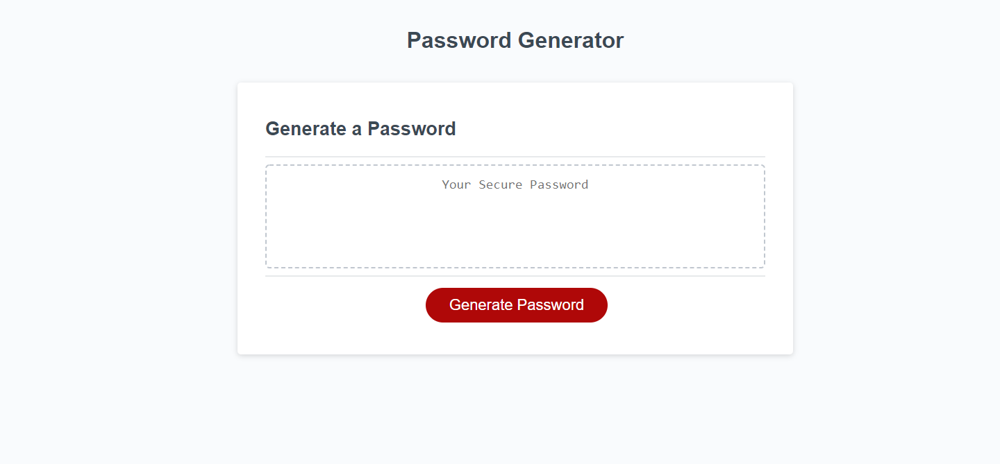
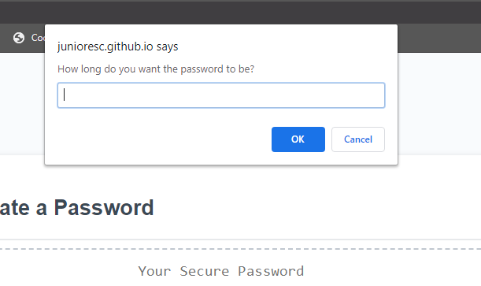
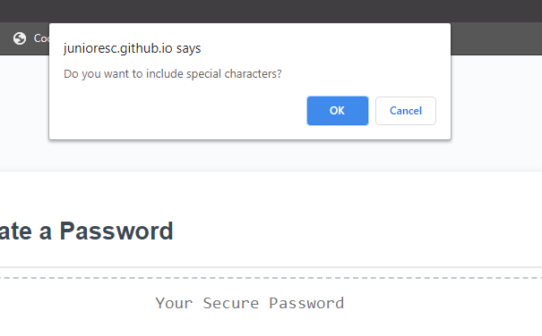
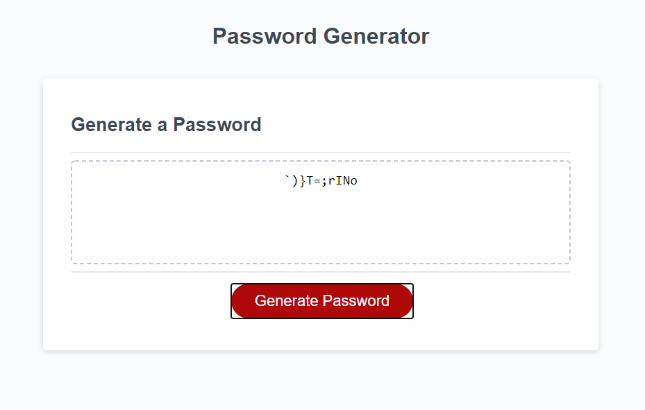

# js-password-generator

## Description 
This code was made in order to produce a random password at the request of the user. The password must be at least 8 characters long and no more than 128. It handles edge cases in case the user decides to not input a response. The generator will accept at least one of the following character types: Uppercase, Lowercase, Numbers, Special Characters. 

## Screenshots

## Website Link
https://junioresc.github.io/js-password-generator/